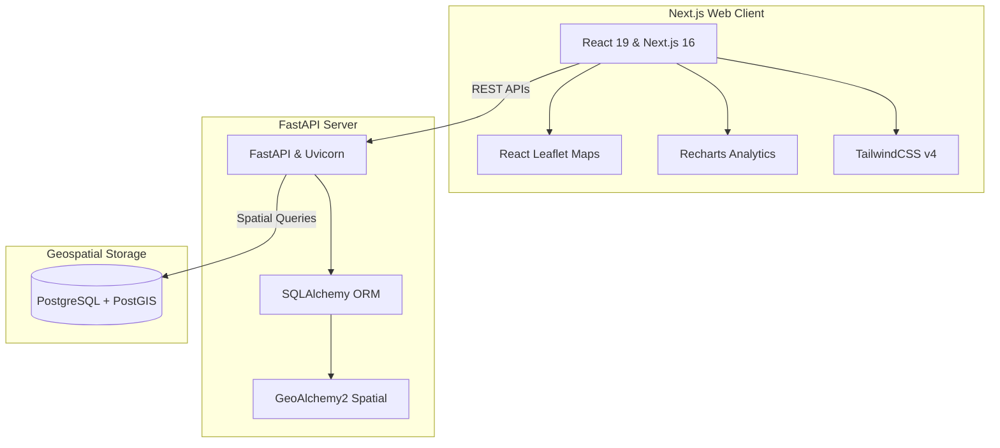

# AeroShield 🛡️
### Smart City Decision Support System (DSS) — Raipur-Bhilai Corridor

AeroShield is a modern, high-performance Decision Support System (DSS) designed to monitor, analyze, and manage urban traffic flow, safety incidents, and environmental pollution metrics along the **Raipur-Bhilai Corridor (NH-53)**. 

The system leverages spatial intelligence (PostGIS), automated predictions (simulated XGBoost), interactive mapping, and real-time visualization dashboards to empower city planners, traffic management units, and environmental agencies with actionable insights.

---

## 🏗️ Architecture & Tech Stack

AeroShield is built as a split-architecture monorepo:



### Key Technologies
*   **Frontend**: [Next.js](https://nextjs.org/) (v16.2), [React](https://react.dev/) (v19.2), [TailwindCSS](https://tailwindcss.com/) (v4.0), [Leaflet](https://leafletjs.com/) (Maps), [Recharts](https://recharts.org/) (Data Visualizations), and [Framer Motion](https://www.framer.com/motion/) (Micro-animations).
*   **Backend**: [FastAPI](https://fastapi.tiangolo.com/) (Python-based ASGI framework), [SQLAlchemy](https://www.sqlalchemy.org/) (ORM), [GeoAlchemy2](https://geoalchemy-2.readthedocs.io/) (Spatial Extensions), and [Uvicorn](https://www.uvicorn.org/) (Web Server).
*   **Database & Infrastructure**: [PostgreSQL 15](https://www.postgresql.org/) with [PostGIS 3.3](https://postgis.net/) (for geographical geometries) and [pgAdmin 4](https://www.pgadmin.org/) (Database UI), orchestrated via [Docker Compose](https://docs.docker.com/compose/).

---

## 📂 Repository Structure

```tree
bhilai/
├── backend/                  # FastAPI Application
│   ├── app/
│   │   ├── api.py            # API Routes and Mock Endpoints
│   │   ├── database.py       # SQLAlchemy Connection Setup
│   │   ├── main.py           # FastAPI Main Entrypoint
│   │   ├── models.py         # SQLAlchemy & GeoAlchemy2 Models
│   │   └── synthetic_data.py # Data Seeder for Spatial Datasets
│   ├── requirements.txt      # Python Dependencies
│   └── .gitignore            # Backend Ignore Rules
├── frontend/                 # Next.js Application
│   ├── src/                  # React components, pages, hooks
│   ├── public/               # Static assets
│   ├── package.json          # Node dependencies and scripts
│   └── .gitignore            # Frontend Ignore Rules
├── docker-compose.yml        # Docker setup for Postgres/PostGIS & pgAdmin
├── .gitignore                # Root Repository-level Ignore Rules
└── README.md                 # Project Overview & Setup Instructions (This file)
```

---

## 🚀 Getting Started

### Prerequisites
Make sure you have the following installed on your local machine:
*   [Docker & Docker Compose](https://docs.docker.com/get-docker/)
*   [Python 3.10+](https://www.python.org/downloads/)
*   [Node.js 18+](https://nodejs.org/)

---

### Step 1: Spin up the Database & pgAdmin
Start the PostGIS database and pgAdmin management console containers:
```bash
docker-compose up -d
```
*   **PostgreSQL Port**: `5432` (Credentials: `postgres` / `password`, DB name: `aeroshield`)
*   **pgAdmin Web UI**: Open [http://localhost:5050](http://localhost:5050)
    *   *Email*: `admin@aeroshield.com`
    *   *Password*: `admin`

---

### Step 2: Set up and Run the Backend
1. Navigate to the backend directory:
   ```bash
   `cd backend`
   ```
2. Create and activate a Python virtual environment:
   ```bash
   # On macOS/Linux:
   python3 -m venv venv
   source venv/bin/activate

   # On Windows:
   python -m venv venv
   venv\Scripts\activate
   ```
3. Install the dependencies:
   ```bash
   pip install --upgrade pip
   pip install -r requirements.txt
   ```
4. **Seed Synthetic Data** (Generates dummy sensors, pollution stations, and vehicle traces inside the spatial DB):
   ```bash
   python -m app.synthetic_data
   ```
5. Start the FastAPI development server:
   ```bash
   uvicorn app.main:app --reload
   ```
   *   The API server will run at [http://localhost:8000](http://localhost:8000)
   *   Interactive API Docs (Swagger): Check out [http://localhost:8000/docs](http://localhost:8000/docs)

---

### Step 3: Set up and Run the Frontend
1. Open a new terminal window and navigate to the frontend directory:
   ```bash
   cd frontend
   ```
2. Install Node dependencies:
   ```bash
   npm install
   ```
3. Start the Next.js development server:
   ```bash
   npm run dev
   ```
   *   The web client will be available at [http://localhost:3000](http://localhost:3000)

---

## 📡 API Endpoints Overview

The backend API server routes traffic requests to `/api/v1/...`. Here are the primary endpoints defined in [api.py](file:///Users/chhatrapaldiawan/Desktop/projects/antigravity/bhilai/backend/app/api.py):

| Method | Endpoint | Description |
| :--- | :--- | :--- |
| **GET** | `/` | API Greeting & Root check |
| **GET** | `/api/v1/sensors` | Returns active traffic sensors with vehicle counts & speeds |
| **GET** | `/api/v1/pollution` | Returns air quality stations along the corridor with AQI metrics |
| **GET** | `/api/v1/predictions/congestion` | Predicts traffic congestion levels across highway segments |
| **GET** | `/api/v1/analytics/vehicles` | Returns 24-hour vehicle volumes timeline split by category |
| **GET** | `/api/v1/analytics/summary` | Dashboard summary metrics (Road Health, Active Sensors, AQI, Incidents) |
| **GET** | `/api/v1/analytics/incidents` | Lists active/resolved traffic incident records (accidents, breakdowns) |
| **GET** | `/api/v1/analytics/vehicle-types` | Distribution of heavy-vehicle types for pie-chart analytics |
| **GET** | `/api/v1/analytics/hourly-pollution` | 24-hour historical air pollution trends showing peak-hour traffic spikes |

---

## 🔒 Git Policies (Ignored Files)
To prevent committing environment configuration, local databases, build files, and package dependencies, the project uses multiple nested `.gitignore` policies:
*   [Root .gitignore](file:///Users/chhatrapaldiawan/Desktop/projects/antigravity/bhilai/.gitignore): Excludes OS junk, IDE configs, Docker volumes, and coordinates both backend and frontend ignore policies globally.
*   [Backend .gitignore](file:///Users/chhatrapaldiawan/Desktop/projects/antigravity/bhilai/backend/.gitignore): Excludes python virtual envs (`venv`), caches (`__pycache__`), unit testing coverages, and local SQLite files.
*   [Frontend .gitignore](file:///Users/chhatrapaldiawan/Desktop/projects/antigravity/bhilai/frontend/.gitignore): Excludes node packages (`node_modules`), next build directory (`.next`), production compile outputs (`build`), and local environment configurations (`.env*`).
